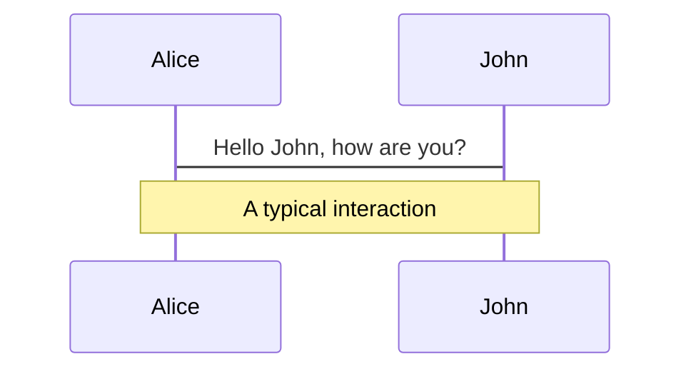
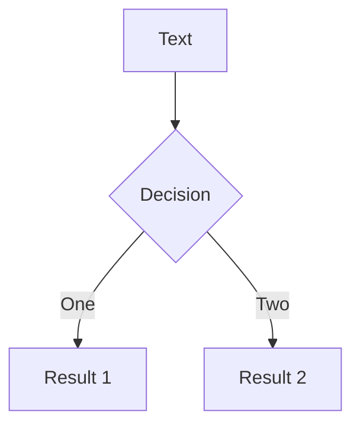
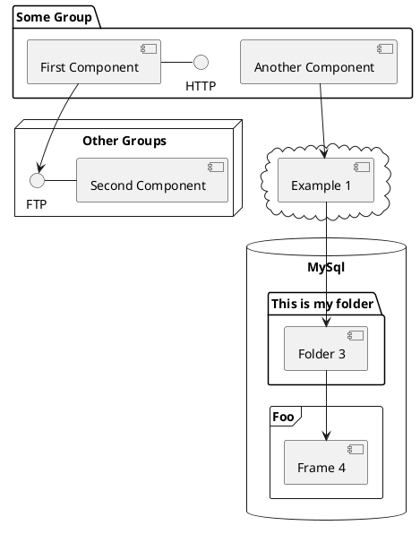

<h1 class="font-800">DYNAMIC PROGRAMMING</h1>

LHSS CS Club Challenge Room - Presented by Li Feng Yin

<div class="pt-12">
  <span @click="$slidev.nav.next" class="px-2 py-1 rounded cursor-pointer" hover="bg-white bg-opacity-10">
    Let's begin <carbon:arrow-right class="inline"/>
  </span>
</div>

<div class="abs-br m-6 flex gap-2">
  <button @click="$slidev.nav.openInEditor()" title="Open in Editor" class="text-xl icon-btn opacity-50 !border-none !hover:text-white">
    <carbon:edit />
  </button>
  <a href="https://github.com/slidevjs/slidev" target="_blank" alt="GitHub"
    class="text-xl icon-btn opacity-50 !border-none !hover:text-white">
    <carbon-logo-github />
  </a>
</div>

<!--
The last comment block of each slide will be treated as slide notes. It will be visible and editable in Presenter Mode along with the slide. [Read more in the docs](https://sli.dev/guide/syntax.html#notes)
-->

---

# Intro


<p style="margin-top: 20px">How did you hear of dynamic programming? Perhaps you've just heard of it this second, or maybe you saw it on LeetCode, or maybe you're secretly a DP master. Well, let me tell you a secret - the name "Dynamic Programming" is misleading! <b class="font-800" style="opacity: 1">It's actually a problem-solving technique!</b> Here's how it works:</p>

<br>

- 1. Break the big, scary problem down into smaller, less scary, sub-problems.
- 2. Solve each sub-problem, breaking those down even smaller if you have to.
- 3. Store the results of each sub-problem after solving.
- 4. When solving a sub-problem that was solved and stored already, use that.

<br>
<br>

<h4> <b class="font-700">BIG IDEA:</b> <u>Reusing subproblems</u></h4>
---

# Difference between other algorithms

### Brute Force
- Loop/recur over all possible solutions
- Often called "naïve approach", simpler but slower

### Divide and Conquer
- Also splits a problem into sub-problems
- Sub-problems are independent, so no need for storing
- Used for different problems

### Greedy Algorithms
- Divides the problem into steps
- At each step, chooses the option that is best at the moment without worrying about the future
- Faster and more efficient, but won't always work


---
layout: image-right
image: https://source.unsplash.com/collection/94734566/1920x1080
---

# Code

Use code snippets and get the highlighting directly![^1]

```ts {all|2|1-6|9|all}
interface User {
  id: number
  firstName: string
  lastName: string
  role: string
}

function updateUser(id: number, update: User) {
  const user = getUser(id)
  const newUser = { ...user, ...update }
  saveUser(id, newUser)
}
```

[^1]: [Learn More](https://sli.dev/guide/syntax.html#line-highlighting)


---

# Components

<div grid="~ cols-2 gap-4">
<div>

You can use Vue components directly inside your slides.

We have provided a few built-in components like `<Tweet/>` and `<Youtube/>` that you can use directly. And adding your custom components is also super easy.

```html
<Counter :count="10" />
```

<!-- ./components/Counter.vue -->
<Counter :count="10" m="t-4" />

Check out [the guides](https://sli.dev/builtin/components.html) for more.

</div>
<div>

```html
<Tweet id="1390115482657726468" />
```

<Tweet id="1390115482657726468" scale="0.65" />

</div>
</div>


---
class: px-20
---

# Themes

Slidev comes with powerful theming support. Themes can provide styles, layouts, components, or even configurations for tools. Switching between themes by just **one edit** in your frontmatter:

<div grid="~ cols-2 gap-2" m="-t-2">

```yaml
---
theme: default
---
```

```yaml
---
theme: seriph
---
```


</div>

Read more about [How to use a theme](https://sli.dev/themes/use.html) and
check out the [Awesome Themes Gallery](https://sli.dev/themes/gallery.html).

---
preload: false
---

# Animations

Animations are powered by [@vueuse/motion](https://motion.vueuse.org/).

```html
<div
  v-motion
  :initial="{ x: -80 }"
  :enter="{ x: 0 }">
  Slidev
</div>
```

<div class="w-60 relative mt-6">
  <div class="relative w-40 h-40">
    
    
    
  </div>

  <div
    class="text-5xl absolute top-14 left-40 text-[#2B90B6] -z-1"
    v-motion
    :initial="{ x: -80, opacity: 0}"
    :enter="{ x: 0, opacity: 1, transition: { delay: 2000, duration: 1000 } }">
    Slidev
  </div>
</div>

<!-- vue script setup scripts can be directly used in markdown, and will only affects current page -->
<script setup lang="ts">
const final = {
  x: 0,
  y: 0,
  rotate: 0,
  scale: 1,
  transition: {
    type: 'spring',
    damping: 10,
    stiffness: 20,
    mass: 2
  }
}
</script>

<div
  v-motion
  :initial="{ x:35, y: 40, opacity: 0}"
  :enter="{ y: 0, opacity: 1, transition: { delay: 3500 } }">

[Learn More](https://sli.dev/guide/animations.html#motion)

</div>

---

<div class="grid grid-cols-3 gap-10 pt-4 -mb-6">







</div>

[Learn More](https://sli.dev/guide/syntax.html#diagrams)


---
layout: center
class: text-center
---

# Thanks for listening

[Documentations](https://sli.dev) · [GitHub](https://github.com/slidevjs/slidev) · [Showcases](https://sli.dev/showcases.html)
