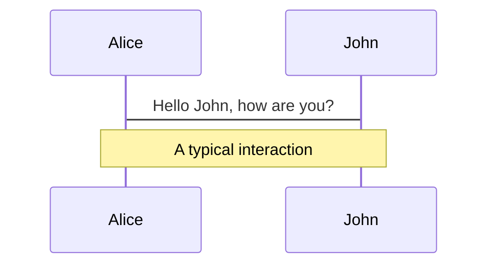
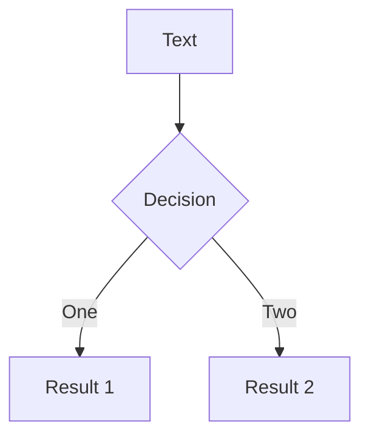
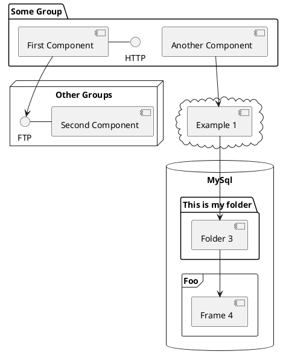

<h1 class="font-800">DYNAMIC PROGRAMMING</h1>

LHSS CS Club Challenge Room - Presented by Li Feng Yin

<div class="pt-12">
  <span @click="$slidev.nav.next" class="px-2 py-1 rounded cursor-pointer" hover="bg-white bg-opacity-10">
    Let's begin <carbon:arrow-right class="inline"/>
  </span>
</div>

<div class="abs-br m-6 flex gap-2">
  <button @click="$slidev.nav.openInEditor()" title="Open in Editor" class="text-xl icon-btn opacity-50 !border-none !hover:text-white">
    <carbon:edit />
  </button>
  <a href="https://github.com/slidevjs/slidev" target="_blank" alt="GitHub"
    class="text-xl icon-btn opacity-50 !border-none !hover:text-white">
    <carbon-logo-github />
  </a>
</div>

<!--
The last comment block of each slide will be treated as slide notes. It will be visible and editable in Presenter Mode along with the slide. [Read more in the docs](https://sli.dev/guide/syntax.html#notes)
-->

---

# Intro


<p style="margin-top: 20px">How did you hear of dynamic programming? Perhaps you've just heard of it this second, or maybe you saw it on LeetCode, or maybe you're secretly a DP master. Well, let me tell you a secret - the name "Dynamic Programming" is misleading! <b class="font-800" style="opacity: 1">It's actually a problem-solving technique!</b> Here's how it works:</p>

<br>

- 1. Break the big, scary problem down into smaller, less scary, sub-problems.
- 2. Solve each sub-problem, breaking those down even smaller if you have to.
- 3. Store the results of each sub-problem after solving.
- 4. When solving a sub-problem that was solved and stored already, use that.

<br>
<br>

<h4> <b class="font-700">BIG IDEA:</b> <u>Reusing subproblems</u></h4>
---

# Difference between other algorithms

### Brute Force
- Loop/recur over all possible solutions
- Often called "naïve approach", simpler but slower

### Divide and Conquer
- Also splits a problem into sub-problems
- Sub-problems are independent, so no need for storing
- Used for different problems

### Greedy Algorithms
- Divides the problem into steps
- At each step, chooses the option that is best at the moment without worrying about the future
- Faster and more efficient, but won't always work


---
layout: image-right
image: https://64.media.tumblr.com/7ce0050a459e97491f5b17ec71ffef71/406991aa4b86fcc5-ec/s500x750/0438aaf8a261ece536b0a418926d61242c88fc07.jpg
---

# LeetCode Problem: Climbing Stairs

<p style="margin-top: 16px">How many possible ways can you climb to the top of a staircase with <code>n</code> steps, provided that you can only climb 1 or 2 steps at a time?</p>

Example solution when `n = 4`:
```py
[1, 1, 1, 1]
[2, 1, 1]
[1, 2, 1]
[1, 1, 2]
[2, 2]
# Therefore, there are 5 solutions
```

<p style="font-size: 12px">(please don't climb stairs like this in real life)</p>

[^1]: [Learn More](https://sli.dev/guide/syntax.html#line-highlighting)


---

# Idea of breaking it down
Instead of solving the big problem all at once, we can split it into smaller steps, which are easier to understand and code. Then, we can combine the results from those steps to get our answer.

1. There is only <u>**1**</u> way to climb 1 step. (obviously)
2. There are <u>**2**</u> ways to climb 2 steps. We can take two small steps, or take a big step in one go.
3. Now, we can tackle a 3-step staircase. We can break this down into two scenarios:
    - Take 1 step, leaving us with 2 steps left. From step 2 → 2 ways to climb 2 steps.
    - Take 2 steps, leaving us with 1 step left. From step 1 → 1 way to climb 1 step.
    Therefore, 2 + 1 = <u>**3**</u> ways to climb 3 stairs.
4. Finally, we can use these steps to solve the 4-step staircase. Again, break it into two scenarios:
    - Take 1 step, leaving us with 3 steps left. From step 3 → 3 ways to climb 3 steps.
    - Take 2 steps, leaving us with 2 steps left. From step 2 → 2 ways to climb 2 steps.
    Therefore, 3 + 2 = <u>**5**</u> ways to climb 4 stairs. 🥳🥳🥳
---

# Solution using loops

```py 
def climb(n):
    # Base cases: If there are 0 or 1 steps, there's only one way to climb.
    if n == 0 or n == 1:
        return 1

    # Initialize variables for storing previous and current number of ways to climb
    prev = 1
    curr = 1

    # Iterate from 2 steps up to the target number of stairs
    for _ in range(2, n + 1):
        # Compute the current number of ways to climb by summing the previous two
        prev, curr = curr, prev + curr

    # Return the current number of ways to climb
    return curr
```

---

# Recursive Solution

<div grid="~ cols-2 gap-4">
<div>
Instead, we can use a recursive approach to start from the big problem, down to the base case.
As shown in the previous problem, `climb(4)` can be broken down into two scenarios:
    <ul>
        <li style="margin-top: 16px">If a 1-step is taken, there are 3 steps left → <code>climb(3)</code> ways.</li>
        &nbsp;&nbsp; - Similarily, this can then be broken down into <code>climb(2)</code> and <code>climb(1)</code>`, which is 2 + 1.
        <li style="margin-top: 16px">If a 2-step is taken, there are 2 steps left → <code>climb(2)</code> ways, which is 2.</li>
    </ul>
    <p style="margin-top: 16px">Therefore, the number of ways is 2 + 1 + 2 = 5.</p>
</div>
<div>

```py
def climb(n):
    # Base cases
    if n == 1: return 1
    if n == 2: return 2

    # Taking a 1-step and a 2-step,
    # then sum the results
    # Eg. climb(4) = climb(3) + climb(2)
    return climb(n - 1) + climb(n - 2)
```

</div>
</div>

---

<div grid="~ cols-2 gap-4">
<div>
However, this solution is not efficient.
</div>
<div>

</div>
</div>

---

# Implementation using Dynamic Programming

<div grid="~ cols-2 gap-4">
<div>
Instead, we can use a recursive approach to start from the big problem, down to the base case.
As shown in the previous problem, `climb(4)` can be broken down into two scenarios:
    <ul>
        <li style="margin-top: 16px">If a 1-step is taken, there are 3 steps left → <code>climb(3)</code> ways.</li>
        &nbsp;&nbsp; - Similarily, this can then be broken down into <code>climb(2)</code> and <code>climb(1)</code>`, which is 2 + 1.
        <li style="margin-top: 16px">If a 2-step is taken, there are 2 steps left → <code>climb(2)</code> ways, which is 2.</li>
    </ul>
    <p style="margin-top: 16px">Therefore, the number of ways is 2 + 1 + 2 = 5.</p>
</div>
<div>

```py
# Memo object!
# Here we store our solutions to subproblems.
memo = {}

def climb(n):
    # Get subproblem from memo if solved
    if n in memo:
        return memo[n]

    # Base cases
    if n == 1: return 1
    if n == 2: return 2

    # Calculate recursively, store inside memo
    memo[n] = climb(n - 1) + climb(n - 2)
    # Return calculated subproblem
    return memo[n]
```

</div>
</div>

---

# Naive Recursion Solution

```py
def pi(n, k, last_element):
    # Base cases
    if n == k or k == 1:
        return 1

    count = 0

    # Loop over all possible values from the last element to the the nth element
    for i in range(last_element, n + 1):
        # Execute the recursion, with n and k reduced by 1, and the last element as i
        count += pi(n - 1, k - 1, i)
    return count
```

---

# Efficient +

<div grid="~ cols-2 gap-4">
<div>
Here's one way to make it more efficient, without using Dynamic Programming:
- Say `n = 20` and `k = 10`.
- Let's say the first value is `2`, all subsequent values must be `>= 2`.
- `10 × 2` = 20, so the max value is 2
- But the code will loop over all of the values greater than 2 (3 to 20).

We can instead put the stop value as n // k + 1. This will make the code stop at the maximum.
</div>
<div>

```py {8,9}
def pi(n, k, last_element):
    # Base cases
    if n == k or k == 1:
        return 1

    count = 0

    # Loop over all possible values from the last element to the maximum element
    for i in range(last_element, n // k + 1):
        # Execute the recursion, with n and k reduced by 1, and the last element as i
        count += pi(n - 1, k - 1, i)
    return count

```

</div>
</div>

---

# Efficient ++

<div grid="~ cols-2 gap-4">
<div>
# Components
</div>
<div>

```py
memo = [[0] * (n + 1) for _ in range(k + 1)]

def pi(n, k, last_element):
    if memo[n][k][last_element] == 0:       
        if n == k:
            memo[n][k][last_element] = 1
        elif k == 1:
            memo[n][k][last_element] = 1
        else:
            count = 0
            for i in range (last_element, n // k + 1):
                count += pi(n-i, k-1, i)
            memo[n][k][last_element] = count
    return memo[n][k][last_element]
```

</div>
</div>
---

<div grid="~ cols-2 gap-4">
<div>

You can use Vue components directly inside your slides.

We have provided a few built-in components like `<Tweet/>` and `<Youtube/>` that you can use directly. And adding your custom components is also super easy.

```html
<Counter :count="10" />
```

<!-- ./components/Counter.vue -->
<Counter :count="10" m="t-4" />

Check out [the guides](https://sli.dev/builtin/components.html) for more.

</div>
<div>

```html
<Tweet id="1390115482657726468" />
```

<Tweet id="1390115482657726468" scale="0.65" />

</div>
</div>


---
class: px-20
---

# Themes

Slidev comes with powerful theming support. Themes can provide styles, layouts, components, or even configurations for tools. Switching between themes by just **one edit** in your frontmatter:

<div grid="~ cols-2 gap-2" m="-t-2">

```yaml
---
theme: default
---
```

```yaml
---
theme: seriph
---
```


</div>

Read more about [How to use a theme](https://sli.dev/themes/use.html) and
check out the [Awesome Themes Gallery](https://sli.dev/themes/gallery.html).

---
preload: false
---

# Animations

Animations are powered by [@vueuse/motion](https://motion.vueuse.org/).

```html
<div
  v-motion
  :initial="{ x: -80 }"
  :enter="{ x: 0 }">
  Slidev
</div>
```

<div class="w-60 relative mt-6">
  <div class="relative w-40 h-40">
    
    
    
  </div>

  <div
    class="text-5xl absolute top-14 left-40 text-[#2B90B6] -z-1"
    v-motion
    :initial="{ x: -80, opacity: 0}"
    :enter="{ x: 0, opacity: 1, transition: { delay: 2000, duration: 1000 } }">
    Slidev
  </div>
</div>

<!-- vue script setup scripts can be directly used in markdown, and will only affects current page -->
<script setup lang="ts">
const final = {
  x: 0,
  y: 0,
  rotate: 0,
  scale: 1,
  transition: {
    type: 'spring',
    damping: 10,
    stiffness: 20,
    mass: 2
  }
}
</script>

<div
  v-motion
  :initial="{ x:35, y: 40, opacity: 0}"
  :enter="{ y: 0, opacity: 1, transition: { delay: 3500 } }">

[Learn More](https://sli.dev/guide/animations.html#motion)

</div>

---

<div class="grid grid-cols-3 gap-10 pt-4 -mb-6">







</div>

[Learn More](https://sli.dev/guide/syntax.html#diagrams)


---
layout: center
class: text-center
---

# Thanks for listening

[Documentations](https://sli.dev) · [GitHub](https://github.com/slidevjs/slidev) · [Showcases](https://sli.dev/showcases.html)
